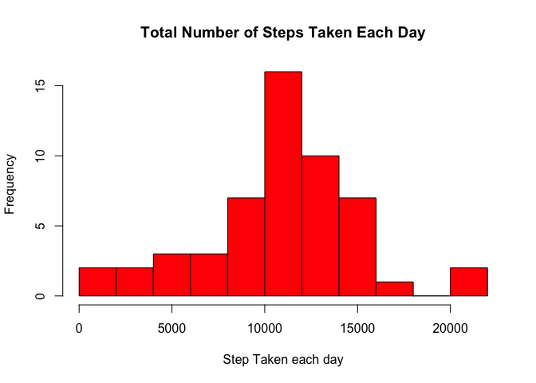
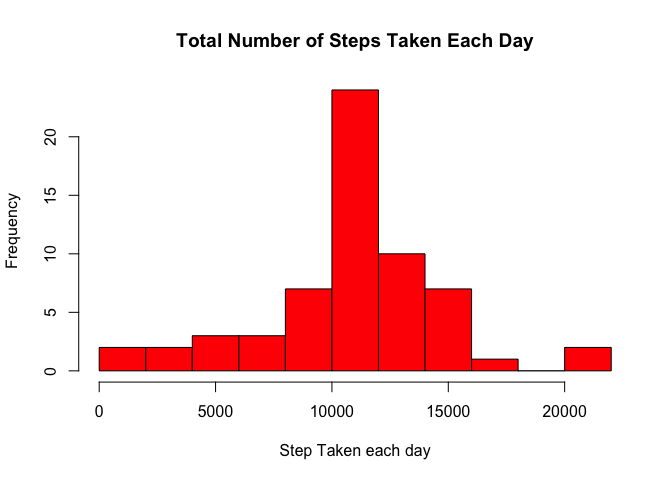

# Reproducible Research: Peer Assessment 1


## Loading and preprocessing the data

```r
library(ggplot2)
data <- read.csv("activity.csv")
data$date <- as.Date(data$date, "%Y-%m-%d")
```


## What is mean total number of steps taken per day?

1.Make a histogram of the total number of steps taken each day

```r
step_sum <- sapply(split(data$steps,data$date),sum)
hist(step_sum, breaks = 10, col = "red", main = "Total Number of Steps Taken Each Day", xlab = "Step Taken each day")
```

 

2.Calculate and report the mean and median total number of steps taken per day

```r
stepMean <- mean(step_sum, na.rm = T)
stepMedian <- median(step_sum, na.rm = T)
```
The mean of total step number is **1.0766189\times 10^{4}** steps

The median of total step number is **10765** steps

## What is the average daily activity pattern?

1.Make a time series plot (i.e. `type = "l"`) of the 5-minute interval (x-axis) and the average number of steps taken, averaged across all days (y-axis)

```r
data_interval <- aggregate(steps ~ interval, data = data, mean)
qplot(interval, steps, data = data_interval, geom = "line")
```

 

2.Which 5-minute interval, on average across all the days in the dataset, contains the maximum number of steps?

```r
max_id <- which.max(data_interval$steps)
max_interval <- data_interval[max_id,]$interval
max_step <- data_interval[max_id,]$steps
```
The max 5-minute interval is the **835** interval.

And the maximum number of steps is **206.1698113** steps. 

## Imputing missing values

1. Calculate and report the total number of missing values in the dataset (i.e. the total number of rows with `NA`s)

```r
na_num <- sum(!complete.cases(data))
```

Total number of missing values is **2304**

2.Devise a strategy for filling in all of the missing values in the dataset. The strategy does not need to be sophisticated. For example, you could use the mean/median for that day, or the mean for that 5-minute interval, etc.

```r
fill <- aggregate(steps ~ interval, data = data, mean)
fill_NAs <- function(x){
        if(is.na(x$steps)){
                x$steps <- fill[fill$interval == x$interval,]$steps
        }
        return(x)
}
```

3.Create a new dataset that is equal to the original dataset but with the missing data filled in.

```r
data_filled <- data
for(i in 1:nrow(data)){
        data_filled[i,] <- fill_NAs(data[i,])
}
```

4.Make a histogram of the total number of steps taken each day and Calculate and report the mean and median total number of steps taken per day. 

```r
step_sum <- sapply(split(data_filled$steps,data_filled$date),sum)
hist(step_sum, breaks = 10, col = "red", main = "Total Number of Steps Taken Each Day", xlab = "Step Taken each day")
```

 


```r
stepMean <- mean(step_sum, na.rm = T)
stepMedian <- median(step_sum, na.rm = T)
```

The mean of total step number is **1.0766189\times 10^{4}** steps

The median of total step number is **1.0766189\times 10^{4}** steps

5.Do these values differ from the estimates from the first part of the assignment? What is the impact of imputing missing data on the estimates of the total daily number of steps?

While the mean value is the same of the first part of the assignment, the median value changed a bit, after filling NAs, the Median value is the same as the mean value 

## Are there differences in activity patterns between weekdays and weekends?

1.Create a new factor variable in the dataset with two levels weekday and weekend indicating whether a given date is a weekday or weekend day.


```r
data_filled$weekday <- c("weekday")
data_filled[weekdays(data_filled$date) %in% c("Saturday","Sunday"),]$weekday <- c("weekend")
data_filled$weekday <- as.factor(data_filled$weekday)
```

2.Make a panel plot containing a time series plot (i.e. type = "l") of the 5-minute interval (x-axis) and the average number of steps taken, averaged across all weekday days or weekend days (y-axis). See the README file in the GitHub repository to see an example of what this plot should look like using simulated data.

```r
weekday_interval <- aggregate(steps ~ interval + weekday, data = data_filled, mean)
g <- ggplot(weekday_interval, aes(x = interval, y = steps))
g  + geom_line() + facet_grid(weekday ~ .)
```

 

